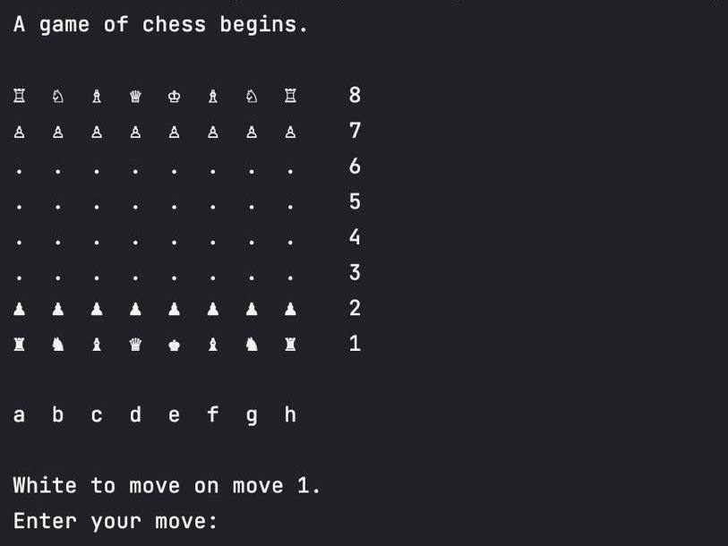

# Chess in Python

Motivated by my passion for chess, I've developed a chess game in Python during my free time to improve my knowledge of Python OOP. Currently, the game requires two players, but I have plans to add a chess engine using a Reinforcement Learning algorithm in the future, capable of beating me. Additionally, I plan to develop a user-friendly GUI for an enhanced gaming experience.

## Installation
Requires Python 3.13 or higher.

```sh
git clone https://github.com/vldryz/chessgame.git
```

## How to play

1. **Execution** \
Run `main.py` in terminal or an IDE of your choice. 

2. **Piece movement** \
To move a piece enter \*start position\* + \*end position\*, e.g. 'e2e4' will move the Pawn from e2 square to e4 square.\
   

3. **Castling** \
To short castle or long castle enter 'o-o' or 'o-o-o', respectively.

4. **End of the game** \
The game ends automatically when a player gets checkmated or in a stalemate if a
player has no legal moves. Alternatively, a player can enter 'resign', 'draw', or 'exit'
to end the game.

Additionally, at any given time, enter 'help' for a list of input options.

## Next steps

1. Implement the fifty-move rule and the repetition of moves that lead to a draw.
2. Make `save move history` method save a proper PGN file.
3. Add a GUI to the game.
4. Implement a chess engine using Reinforcement Learning algorithm.

## License
[MIT](https://choosealicense.com/licenses/mit/)
